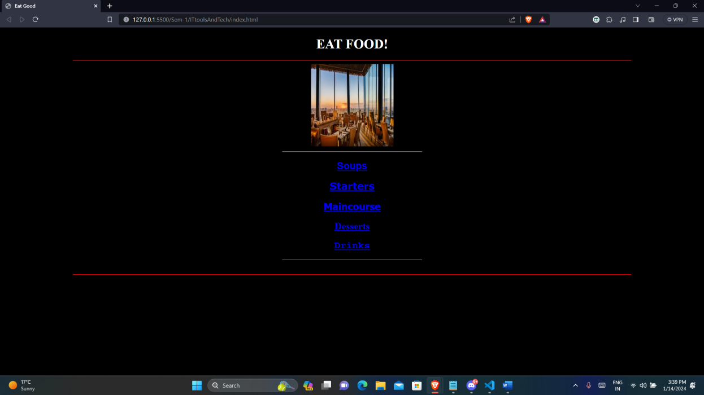
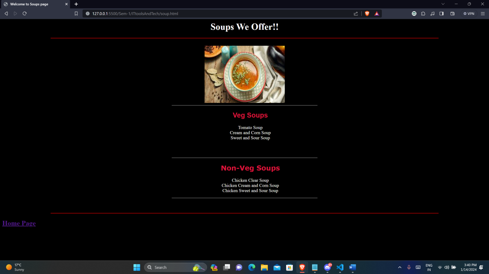
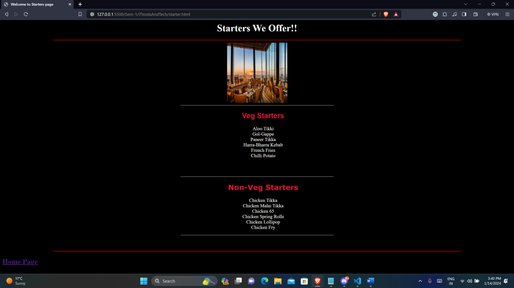
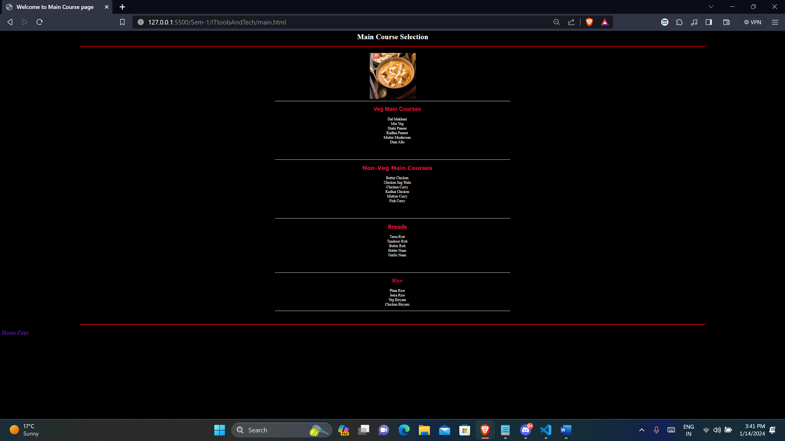
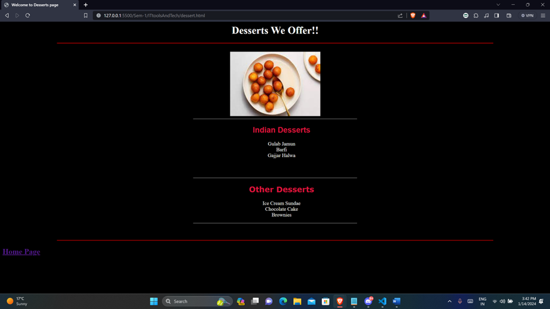
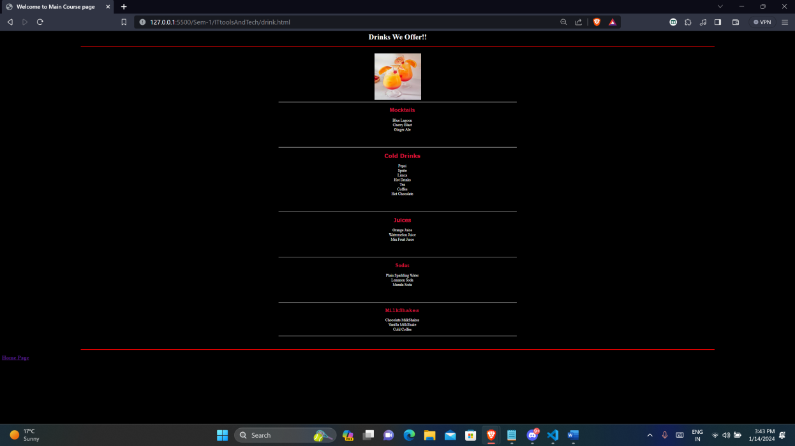

# EatGood
- This is a basic website for restaurant (named "**EatGood**"). 

- The language used for this website is HTML.

# Documentation
- `index.html` : This is the main page in which we can see the various categories of the food served in the restaurant.
- `soup.html` : This shows the various different soups that the restaurant offers.
- `starter.html` : This shows the various different starters that the restaurant offers.
- `main.html` : This shows the various different Main course dishes that the restaurant offers.
- `dessert.html` : This shows the various different desserts that the restaurant offers.
- `drink.html` : This shows the various different drinks that the restaurant offers.

# Screenshots

- index.html:

- soup.html:

- starter.html:

- main.html:

- desset.html:

- drink.html:
